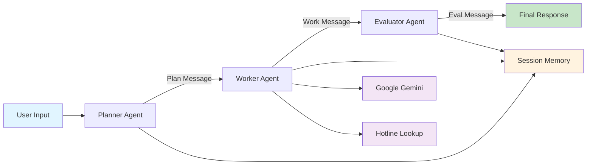
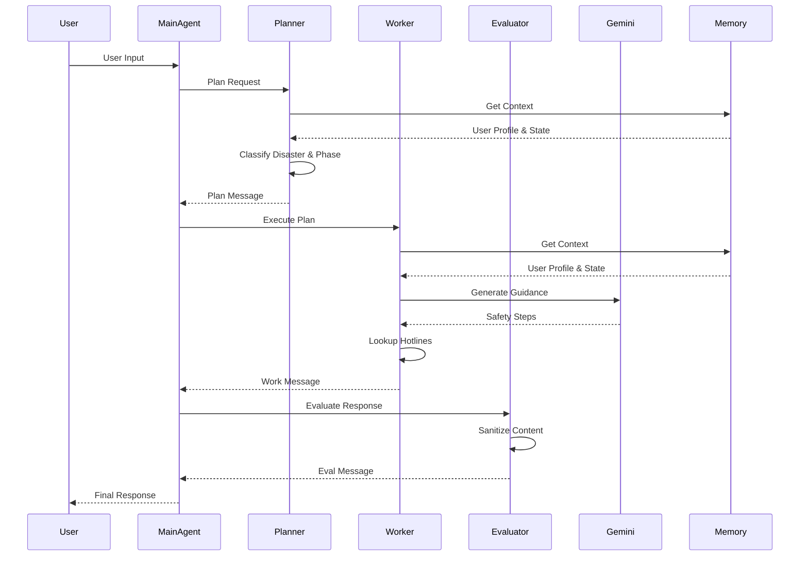

# Crisis Info Navigator

AI-powered multi-agent system that provides real-time, non-medical disaster safety guidance using Google Gemini.

## Overview

Crisis Info Navigator is an intelligent crisis preparedness and response assistant developed as part of the Kaggle × Google 5-Day AI Agents Intensive Course. The system leverages a multi-agent architecture to deliver contextual, actionable safety guidance for various disaster scenarios while maintaining strict non-medical boundaries. By combining agent orchestration, tool usage, and dynamic LLM generation, the project demonstrates practical application of modern AI agent principles to solve real-world problems in disaster management.

## Key Features

- **Multi-Agent Architecture**: Implements a Planner → Worker → Evaluator pipeline for structured response generation
- **Disaster Classification**: Automatically detects disaster types (earthquake, flood, cyclone, fire, heatwave, landslide) using keyword heuristics
- **Phase Detection**: Identifies crisis phase (preparedness, during, recovery) to provide contextually relevant guidance
- **Dynamic Guidance Generation**: Uses Google Gemini 2.5 Flash to generate tailored, non-medical safety steps in real-time
- **Emergency Hotline Integration**: Provides region-specific emergency contact information
- **Session Memory**: Maintains conversation context and user profile across interactions
- **Safety Filtering**: Implements content sanitization to prevent medical advice generation
- **Observability**: Comprehensive logging and trace ID tracking for debugging and monitoring
- **Agent-to-Agent Protocol**: Structured message passing system for inter-agent communication
- **CLI Interface**: Interactive command-line interface for user interaction

## Tech Stack

| Technology/Framework | Version | Purpose |
|---------------------|---------|---------|
| Python | 3.x | Core programming language |
| Google Generative AI | >=0.8.0 | LLM integration and API access |
| Google Gemini | 2.5 Flash | Dynamic safety guidance generation |
| Standard Library | - | logging, uuid, dataclasses, os, textwrap |

## System Architecture

The system follows a three-agent pipeline architecture where each agent has a specific responsibility:



### Agent Responsibilities

1. **Planner Agent**
   - Analyzes user input to detect disaster type and phase
   - Creates execution plan with objectives and tool calls
   - Updates session memory with classification results

2. **Worker Agent**
   - Executes the plan generated by the Planner
   - Calls Google Gemini for dynamic safety guidance
   - Retrieves region-specific emergency hotlines
   - Formats draft response with guidance and contacts

3. **Evaluator Agent**
   - Performs safety and clarity checks on draft response
   - Applies content sanitization filters
   - Approves or requests revisions
   - Returns final sanitized response

## Project Workflow



### User Journey

1. **Input**: User submits a query about disaster preparedness or response
2. **Classification**: Planner analyzes input to determine disaster type and phase
3. **Planning**: Planner creates execution plan with tool call specifications
4. **Execution**: Worker calls Google Gemini for dynamic guidance generation
5. **Enhancement**: Worker adds region-specific emergency hotline information
6. **Evaluation**: Evaluator performs safety checks and content sanitization
7. **Output**: User receives structured, safe, and actionable guidance

## Repository Structure

```
Crisis-Info-Navigator-main/
    ├── README.md
    ├── __init__.py
    ├── app.py                    # CLI interface for interactive chat
    ├── main_agent.py             # Main orchestration and agent coordination
    ├── run_demo.py               # Demo script for testing
    ├── requirements.txt          # Python dependencies
    ├── agents/
    │   ├── __init__.py
    │   ├── planner.py           # Disaster classification and planning logic
    │   ├── worker.py            # Plan execution and LLM integration
    │   └── evaluator.py         # Response evaluation and safety filtering
    ├── core/
    │   ├── __init__.py
    │   ├── a2a_protocol.py      # Agent-to-agent message protocol
    │   ├── context_engineering.py  # Context building for agents
    │   └── observability.py    # Logging and event tracking
    ├── memory/
    │   ├── __init__.py
    │   └── session_memory.py   # Session and user profile management
    └── tools/
        ├── __init__.py
        └── tools.py            # LLM integration, hotlines, utilities
```

### Key Files Explained

- **main_agent.py**: Core orchestration logic that coordinates the three-agent pipeline
- **agents/planner.py**: Implements keyword-based disaster type and phase detection
- **agents/worker.py**: Handles Google Gemini API calls and hotline lookups
- **agents/evaluator.py**: Performs content sanitization and safety validation
- **core/a2a_protocol.py**: Defines message structure and trace ID generation
- **core/context_engineering.py**: Builds agent-specific context from memory
- **core/observability.py**: Provides structured logging for debugging
- **memory/session_memory.py**: In-memory session and profile storage
- **tools/tools.py**: Google Gemini integration and utility functions
- **app.py**: Interactive CLI for user testing and demonstration

## Installation

### Prerequisites

- Python 3.8 or higher
- Google API Key with access to Gemini 2.5 Flash

### Setup Steps

1. **Clone the repository**
   ```bash
   git clone <repository-url>
   cd Crisis-Info-Navigator-main
   ```

2. **Install dependencies**
   ```bash
   pip install -r project/requirements.txt
   ```

3. **Set up Google API Key**
   ```bash
   export GOOGLE_API_KEY="your-api-key-here"
   ```

   Alternatively, create a `.env` file or set it in your IDE's environment variables.

## Usage

### Interactive CLI Mode

Run the interactive chat interface:

```bash
python project/app.py
```

Example interactions:
- "How should I prepare for an earthquake?"
- "There's a flood happening right now, what should I do?"
- "What steps should I take after a cyclone?"

### Demo Mode

Run a single demo query:

```bash
python project/run_demo.py
```

### Programmatic Usage

```python
from project.main_agent import run_agent

response = run_agent("How should I prepare for a wildfire?")
print(response)
```

## AI Agent Concepts Demonstrated

This project implements several core AI agent principles taught in the Google × Kaggle AI Agents Intensive Course:

### 1. Multi-Agent Collaboration
- **Specialized Roles**: Each agent has a distinct responsibility (planning, execution, evaluation)
- **Pipeline Architecture**: Sequential agent flow with clear handoff points
- **Agent Autonomy**: Each agent operates independently within its domain

### 2. Agent-to-Agent Communication
- **Structured Messaging**: Uses `AgentMessage` dataclass with trace IDs for tracking
- **Message Types**: PLAN_RESPONSE, WORK_RESPONSE, EVAL_RESPONSE for clear intent
- **Traceability**: UUID-based trace IDs link all messages in a conversation

### 3. Tool Usage
- **LLM Integration**: Google Gemini 2.5 Flash for dynamic content generation
- **External Tools**: Hotline lookup, calculator, generic search capabilities
- **Tool Orchestration**: Planner specifies tools, Worker executes them

### 4. Context Engineering
- **Agent-Specific Context**: Each agent receives tailored context (system policy, user profile, state)
- **Session Memory**: Maintains conversation history and user preferences
- **Dynamic Context Building**: Context assembled based on agent role and current state

### 5. Memory Management
- **Session Storage**: In-memory storage for conversation state
- **User Profiles**: Stores user-specific information (region, preferences)
- **State Persistence**: Maintains disaster type and phase across interactions

### 6. Observability
- **Structured Logging**: Event-based logging with trace IDs
- **Event Tracking**: user_message, plan_created, work_completed, evaluation_completed
- **Debugging Support**: Clear logs for troubleshooting agent behavior

### 7. Safety and Evaluation
- **Content Filtering**: Sanitization removes medical advice phrases
- **Quality Checks**: Evaluator validates response clarity and safety
- **Fallback Handling**: Graceful degradation when guidance cannot be generated

## Learning Outcomes

Through the development of Crisis Info Navigator, the following key concepts from the Google × Kaggle AI Agents Intensive Course were applied and mastered:

- **Agent Design Patterns**: Understanding when to use single vs. multi-agent architectures
- **Prompt Engineering**: Crafting system instructions for safe, factual disaster guidance
- **Tool Integration**: Connecting LLMs with external APIs and data sources
- **State Management**: Implementing session memory for context-aware interactions
- **Error Handling**: Building robust systems with graceful fallbacks
- **Logging and Debugging**: Implementing observability for complex agent flows
- **Safety Considerations**: Designing systems with built-in content filters
- **API Integration**: Working with Google Generative AI and Gemini models
- **Modular Architecture**: Building maintainable, extensible codebases
- **Real-World Application**: Applying AI agent concepts to solve practical problems

## Future Improvements

Potential enhancements to extend the system's capabilities:

- **Web Interface**: Build a React or Streamlit frontend for better user experience
- **Database Integration**: Replace in-memory storage with PostgreSQL or Redis for persistence
- **Enhanced Classification**: Use ML models instead of keyword heuristics for disaster detection
- **Multi-Language Support**: Add translation capabilities for broader accessibility
- **Location Services**: Integrate geolocation for automatic region detection
- **Real-Time Data**: Connect to weather APIs and emergency alert systems
- **Expanded Hotline Database**: Comprehensive global emergency contact database
- **User Authentication**: Add user accounts for personalized recommendations
- **Mobile Application**: Develop iOS/Android apps for on-the-go access
- **Voice Interface**: Add speech-to-text and text-to-speech capabilities
- **Offline Mode**: Cache guidance for use during network outages

## Author

**Poojitha Pujari**

Developed as part of the Kaggle × Google 5-Day AI Agents Intensive Course.

---

**Note**: This system provides non-medical safety guidance only. For medical emergencies, always contact professional healthcare services or emergency responders.
